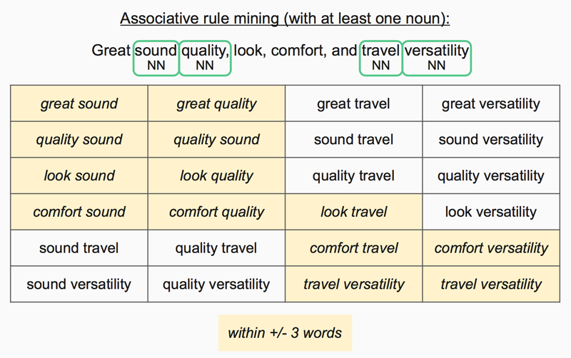

This project was developed as a capstone project for Galvanize's Data Science Immersive course.  
Try out the application [here](http://www.reviewsummarizer.net/)

## Background

Amazon has one of the largest corpus or reviews out there on the internet, but there is no feature that highlights how frequently word terms appear in the reviews for a product. This is implemented in other sites like yelp, glassdoor, and tripadvisor. Review highlights provide a simple way for consumers to get a snapshot of what people review about without sifting through a ton of reviews. Example of review highlights in yelp:


The goal of Amazon Review Summarizer is to build a web application that can execute the following tasks for any product on amazon:
* Extract common aspects from a corpus of reviews
* Perform opinion mining (positive and negative polarity) on top aspects

Amazon Review Summarizer also includes a tool for side-by-side product comparison. Given any two related products, a consumer will be able to compare the sentiments for any top aspect common to both products. Here is an example of this tool in action:


## Methodology

The main pipeline for Amazon Review Summarizer is composed of 6 steps:

1. Scrape the 300 most helpful Amazon reviews for the input product url(s).
2. Perform dependency parsing and part of speech tagging on every sentence in every scraped review.
3. Collect all nouns used in the reviews as candidate unigram aspects. Filter out unigrams that are unlikely to be aspects.
4. Perform association rule mining to find candidate bigram and trigram aspects. Use set of words obtained from Step #3 and compactness pruning to filter out bigrams that are unlikely to be aspects. Connect set of bigram words that appear frequently together in same sentences into trigrams.
5. Perform sentiment analysis and label reviews as either positive sentiment, negative sentiment, or mixed sentiment (unable to predict the sentiment polarity).
6. Display sentiment analysis results for the top 10 frequent aspects.

### Aspect Mining

* Tokenization
 * Split reviews into sentences
* POS tagging
 * Tag each word of sentence with its contextual part of speech  
 * Collect words used in noun context as candidate unigram aspects
* Dependency Parsing
 * Analyze sentences to track the dependency types between linguistic units  
 
* Lemmatization
 * Lemmatize words into root form to count aspect frequency across all sentences and user reviews
* Associative Rule Mining
 * Finding combination of words that appear together within a sentences
 * Used for determining candidate bigram aspects (each bigram must contain at least one valid unigram)
 * Limited the word radius to +/- 3 words as most bigram aspects tend to have words close to each other
  

##### Feature engineering

* AMOD %:  
the percentage of amod dependencies among all the dependencies of an unigram aspect
* Average Word Distance:  
average absolute distance between bigrams words across all sentences in all reviews
* PMI (pointwise mutual information):  
a measure of association of two words with respect to the frequency each individual words appear  


##### Evaluation

Evaluated the model against products with over 1000+ reviews in a publicly available Amazon dataset. I individually hand-labeled data and chose tuning parameters based on best accuracy.

| CATEGORY  | DATASET                                                  | ENGINEERED FEATURES                                              | ACCURACY |
|-----------|----------------------------------------------------------|------------------------------------------------------------------|----------|
| Unigrams  | Top 20 frequent unigrams per product                     | AMOD %                                                           | 74%      |
| Bigrams   | Top 20 frequent bigrams per product                      | Average Word Distance; PMI                                       | 82%      |

### Sentiment Analysis

TextBlob and Afinn sentiment analysis packages were used to obtain polarity scores on sentences containing aspects. If a review contained multiple sentences containing the aspect under evaluation, all the sentences from the review containing the aspect were combined together and passed through the sentiment analyzer.

##### Evaluation

To evaluate the effectiveness of these packages, random sentences were sampled and hand-labeled with positive, negative, or neutral sentiment labels. A decision tree like model was used (with polarity scores and customer rating of review as a whole as features) to make a sentiment prediction on the aspect.

| CATEGORY  | DATASET                                                  | ENGINEERED FEATURES                                              | ACCURACY |
|-----------|----------------------------------------------------------|------------------------------------------------------------------|----------|
| Sentiment | 200 random sentences with aspects from every star rating | Polarity scores from textblob, afinn sentiment analysis packages | 72%      |

## How to Run The Code

### Package Dependencies
* [Anaconda](https://docs.continuum.io/anaconda/install)
* afinn ```pip install afinn```
* celery ```pip install celery```
* [mongoDB](https://docs.mongodb.com/manual/administration/install-community/)
* [redis](https://www.digitalocean.com/community/tutorials/how-to-install-and-use-redis)
* [spacy](https://spacy.io/docs/#getting-started)
* textblob ```pip install textblob```

### Execution
1. Install required packages
2. Start mongoDB with the following command: ```sudo mongod```
3. Start mongo with the following command: ```mongo```
4. Start redis with the following command: ```redis-server```
5. Start celery with the following command from the app folder: ```celery -A app.celery worker```
6. Start flask app with the following command from the app folder: ```python app.py```


## References
* [amadown2py](https://github.com/aesuli/amadown2py)
* Hu & Liu's [Mining and Summarizing Customer Reviews](http://users.cis.fiu.edu/~lli003/Sum/KDD/2004/p168-hu.pdf) (2004)
* Hu & Liu's [Mining Opinion Features in Customer Reviews](https://www.aaai.org/Papers/AAAI/2004/AAAI04-119.pdf) (2004)
* Bing Liu's [Sentiment Analysis and Opinion Mining](http://www.cs.uic.edu/~liub/FBS/SentimentAnalysis-and-OpinionMining.pdf) (2012)
